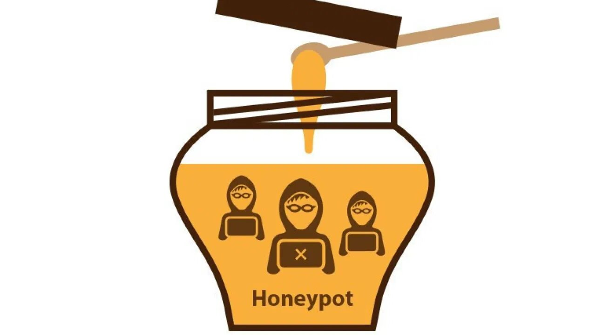

# Honeypot Detector - By Ruslan - 2021

An honeypot detector for many chains


#### You can take the tokens back at any time through the contract.

In this case only PancakeSwap.js.

```javascript
const mainTokentoSell = 'the amount of WBNB you have transferred';
```

#### How to config:

```javascript
export const BSCaddress = '';
export const ETHERaddress = '';
export const AVAXaddress = '';
export const FTMaddress = '';
export const MATICaddress = '';
export const XDAIaddress = '';
export const ownerAddress = '';
```

#### Available dexs:

- pancakeswap (BSC)
- traderjoe (AVAX)
- pangolin (AVAX)
- spookyswap (FTM)
- quickswap (MATIC)
- honeyswap (XDAI)
- sushiswap (ETH)
- uniswap2 (ETH)
- uniswap3 (ETH)

## Possible results

```javascript
{
  data: {
    isHoneypot: true/false,
    buyFee: buyTax,
    sellFee: sellTax,
    buyGas: buyGas,
    sellGas: sellGas,
    maxTokenTransaction: maxTokenTransaction,
    maxTokenTransactionMain: maxTokenTransactionMain,
    tokenSymbol: tokenSymbol,
    mainTokenSymbol: mainTokensymbol,
    priceImpact: priceImpact,
    problem: problem,
    extra: extra,
  }
}
* maxTokenTransactionMain is the maximum tradable quantity converted into mainToken.
```

## Configuration

You can configure the project by editing the Crypto_Honeypot_Detector/config/const.js file.

```javascript
// Server port
export const port = 8080;

// Max price impact %
export const priceImp = 2;

// Max safe fee
export const maxBuyFee = 10;
export const maxSellFee = 10;
```

## Maintainer

- Ruslan K. shouldperfect330@gmail.com
